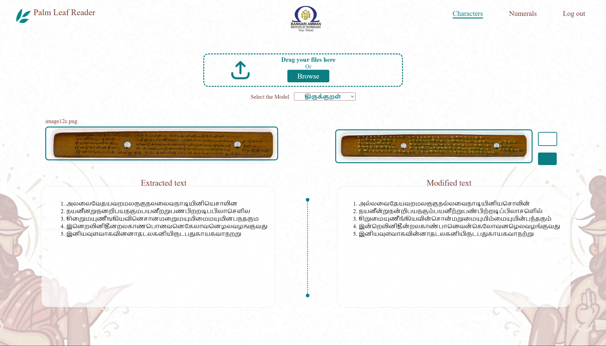
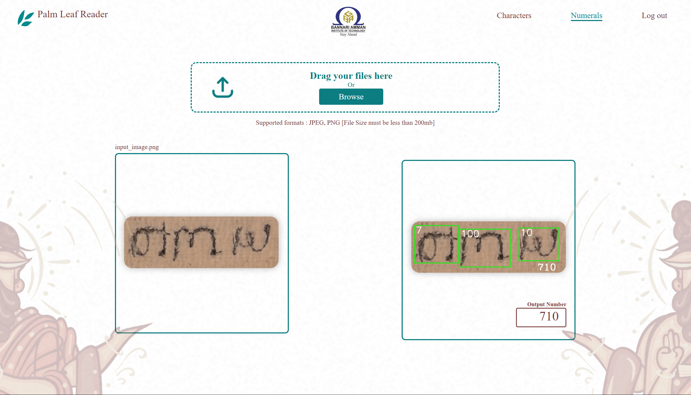

# 🕮 AI-Based Palm Leaf Manuscript Reader

This project converts ancient Tamil palm-leaf manuscripts (ஓலைச் சுவடிகள்) into modern readable Tamil text using AI, image processing, and deep learning.

---

## 🧠 About the Project

- Digitizes historical Tamil palm-leaf manuscripts using deep learning.
- CNN model trained on Tamil characters from palm leaf datasets.
- Converts scanned images into machine-readable Tamil Unicode text.
- Designed with a simple Flask-based web interface for public use.

---

## ⚙️ Features

- 🖼️ Image Preprocessing: Grayscale, binarization, denoising
- 🧠 Deep Learning: CNN (TensorFlow/Keras) for Tamil OCR
- 📤 Upload Interface: User-friendly Flask web app
- 📜 Output: Unicode Tamil text for further use or study

---

## 📂 Project Structure

```plaintext
AI_Based_Palm_Leaf_Manuscript_Reader/
├── app.py                  # Main Flask web application
├── requirements.txt        # Required Python packages
├── model_code/             # Python scripts for training & preprocessing
│   ├── character_training.py
│   ├── preprocess_leaf_image.py
├── Numerals.model          # Pre-trained model (numerals)
├── Thirukkural.model       # Pre-trained model (text)
├── templates/              # HTML files for Flask pages
│   ├── login.html
│   ├── upload.html
│   ├── result.html
├── static/                 # Images, CSS, JavaScript
│   ├── sample_input.png
│   ├── output_result.png
│   └── style.css
└── README.md
```
## 🌐 Web Interface Preview

### 🔐 Login Page


---

### 📥 Output for the Thirukkural Model (Palm Leaf Manuscript)



---

### 📥 Output for the Numeral Model (Palm Leaf Manuscript)



---

## 🚀 Getting Started

### 🧪 Setup

```bash
# Clone the repository
git clone https://github.com/KarthickRio/AI_Based_Palm_Leaf_Manuscript_Reader.git
cd AI_Based_Palm_Leaf_Manuscript_Reader

# (Optional) Create and activate virtual environment
python -m venv venv
source venv/bin/activate  # For Windows: venv\Scripts\activate

# Install required packages
pip install -r requirements.txt

# Run the application
python app.py
